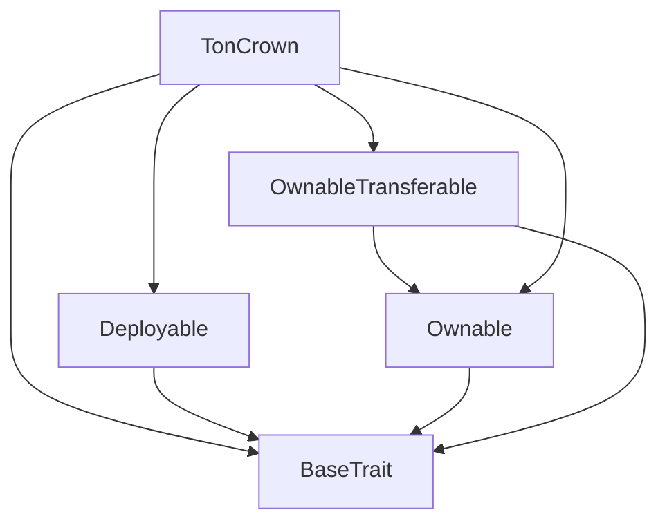
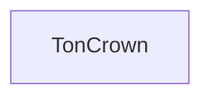

# Tact compilation report
Contract: TonCrown
BoC Size: 7986 bytes

## Structures (Structs and Messages)
Total structures: 32

### DataSize
TL-B: `_ cells:int257 bits:int257 refs:int257 = DataSize`
Signature: `DataSize{cells:int257,bits:int257,refs:int257}`

### SignedBundle
TL-B: `_ signature:fixed_bytes64 signedData:remainder<slice> = SignedBundle`
Signature: `SignedBundle{signature:fixed_bytes64,signedData:remainder<slice>}`

### StateInit
TL-B: `_ code:^cell data:^cell = StateInit`
Signature: `StateInit{code:^cell,data:^cell}`

### Context
TL-B: `_ bounceable:bool sender:address value:int257 raw:^slice = Context`
Signature: `Context{bounceable:bool,sender:address,value:int257,raw:^slice}`

### SendParameters
TL-B: `_ mode:int257 body:Maybe ^cell code:Maybe ^cell data:Maybe ^cell value:int257 to:address bounce:bool = SendParameters`
Signature: `SendParameters{mode:int257,body:Maybe ^cell,code:Maybe ^cell,data:Maybe ^cell,value:int257,to:address,bounce:bool}`

### MessageParameters
TL-B: `_ mode:int257 body:Maybe ^cell value:int257 to:address bounce:bool = MessageParameters`
Signature: `MessageParameters{mode:int257,body:Maybe ^cell,value:int257,to:address,bounce:bool}`

### DeployParameters
TL-B: `_ mode:int257 body:Maybe ^cell value:int257 bounce:bool init:StateInit{code:^cell,data:^cell} = DeployParameters`
Signature: `DeployParameters{mode:int257,body:Maybe ^cell,value:int257,bounce:bool,init:StateInit{code:^cell,data:^cell}}`

### StdAddress
TL-B: `_ workchain:int8 address:uint256 = StdAddress`
Signature: `StdAddress{workchain:int8,address:uint256}`

### VarAddress
TL-B: `_ workchain:int32 address:^slice = VarAddress`
Signature: `VarAddress{workchain:int32,address:^slice}`

### BasechainAddress
TL-B: `_ hash:Maybe int257 = BasechainAddress`
Signature: `BasechainAddress{hash:Maybe int257}`

### Deploy
TL-B: `deploy#946a98b6 queryId:uint64 = Deploy`
Signature: `Deploy{queryId:uint64}`

### DeployOk
TL-B: `deploy_ok#aff90f57 queryId:uint64 = DeployOk`
Signature: `DeployOk{queryId:uint64}`

### FactoryDeploy
TL-B: `factory_deploy#6d0ff13b queryId:uint64 cashback:address = FactoryDeploy`
Signature: `FactoryDeploy{queryId:uint64,cashback:address}`

### ChangeOwner
TL-B: `change_owner#819dbe99 queryId:uint64 newOwner:address = ChangeOwner`
Signature: `ChangeOwner{queryId:uint64,newOwner:address}`

### ChangeOwnerOk
TL-B: `change_owner_ok#327b2b4a queryId:uint64 newOwner:address = ChangeOwnerOk`
Signature: `ChangeOwnerOk{queryId:uint64,newOwner:address}`

### User
TL-B: `_ address:address referrer:address level:uint8 vipClass:uint8 directReferrals:uint16 totalReferrals:uint32 lastCheckIn:uint32 levelExpiration:uint32 totalEarned:coins pendingRewards:coins isActive:bool registrationTime:uint32 = User`
Signature: `User{address:address,referrer:address,level:uint8,vipClass:uint8,directReferrals:uint16,totalReferrals:uint32,lastCheckIn:uint32,levelExpiration:uint32,totalEarned:coins,pendingRewards:coins,isActive:bool,registrationTime:uint32}`

### StakeInfo
TL-B: `_ amount:coins startTime:uint32 duration:uint32 vipClass:uint8 autoRestake:bool lastClaim:uint32 totalClaimed:coins isActive:bool = StakeInfo`
Signature: `StakeInfo{amount:coins,startTime:uint32,duration:uint32,vipClass:uint8,autoRestake:bool,lastClaim:uint32,totalClaimed:coins,isActive:bool}`

### VipConfig
TL-B: `_ dailyRoi:uint16 minLevel:uint8 maxLevel:uint8 stakingRoi:uint16 = VipConfig`
Signature: `VipConfig{dailyRoi:uint16,minLevel:uint8,maxLevel:uint8,stakingRoi:uint16}`

### ReferralNode
TL-B: `_ referrer:address referralIndex:uint8 depth:uint8 = ReferralNode`
Signature: `ReferralNode{referrer:address,referralIndex:uint8,depth:uint8}`

### PlatformStats
TL-B: `_ totalUsers:uint32 totalStaked:coins totalDistributed:coins activeStakes:uint32 = PlatformStats`
Signature: `PlatformStats{totalUsers:uint32,totalStaked:coins,totalDistributed:coins,activeStakes:uint32}`

### Register
TL-B: `register#f76b6fae referrerAddress:address = Register`
Signature: `Register{referrerAddress:address}`

### UpgradeLevel
TL-B: `upgrade_level#3ab103cb targetLevel:uint8 = UpgradeLevel`
Signature: `UpgradeLevel{targetLevel:uint8}`

### CheckIn
TL-B: `check_in#37517518  = CheckIn`
Signature: `CheckIn{}`

### StakeTON
TL-B: `stake_ton#fc4f07ec duration:uint32 autoRestake:bool = StakeTON`
Signature: `StakeTON{duration:uint32,autoRestake:bool}`

### ClaimStakingRewards
TL-B: `claim_staking_rewards#cb471282  = ClaimStakingRewards`
Signature: `ClaimStakingRewards{}`

### UnstakeTON
TL-B: `unstake_ton#a0732b3c  = UnstakeTON`
Signature: `UnstakeTON{}`

### ClaimPendingRewards
TL-B: `claim_pending_rewards#e6304cbb  = ClaimPendingRewards`
Signature: `ClaimPendingRewards{}`

### SetCreatorWallet
TL-B: `set_creator_wallet#1b182499 walletId:uint8 address:address = SetCreatorWallet`
Signature: `SetCreatorWallet{walletId:uint8,address:address}`

### UpdateVipConfig
TL-B: `update_vip_config#06b6967e vipClass:uint8 config:VipConfig{dailyRoi:uint16,minLevel:uint8,maxLevel:uint8,stakingRoi:uint16} = UpdateVipConfig`
Signature: `UpdateVipConfig{vipClass:uint8,config:VipConfig{dailyRoi:uint16,minLevel:uint8,maxLevel:uint8,stakingRoi:uint16}}`

### UpdateLevelCost
TL-B: `update_level_cost#e3b5e901 level:uint8 cost:coins = UpdateLevelCost`
Signature: `UpdateLevelCost{level:uint8,cost:coins}`

### EmergencyPause
TL-B: `emergency_pause#3f7082c1 paused:bool = EmergencyPause`
Signature: `EmergencyPause{paused:bool}`

### TonCrown$Data
TL-B: `_ owner:address creatorWallet1:address creatorWallet2:address creatorWallet3:address creatorWallet4:address users:dict<address, ^User{address:address,referrer:address,level:uint8,vipClass:uint8,directReferrals:uint16,totalReferrals:uint32,lastCheckIn:uint32,levelExpiration:uint32,totalEarned:coins,pendingRewards:coins,isActive:bool,registrationTime:uint32}> stakes:dict<address, ^StakeInfo{amount:coins,startTime:uint32,duration:uint32,vipClass:uint8,autoRestake:bool,lastClaim:uint32,totalClaimed:coins,isActive:bool}> referralNodes:dict<address, ^ReferralNode{referrer:address,referralIndex:uint8,depth:uint8}> levelCosts:dict<int, int> vipConfigs:dict<int, ^VipConfig{dailyRoi:uint16,minLevel:uint8,maxLevel:uint8,stakingRoi:uint16}> totalUsers:uint32 totalStaked:coins totalDistributed:coins activeStakes:uint32 isPaused:bool = TonCrown`
Signature: `TonCrown{owner:address,creatorWallet1:address,creatorWallet2:address,creatorWallet3:address,creatorWallet4:address,users:dict<address, ^User{address:address,referrer:address,level:uint8,vipClass:uint8,directReferrals:uint16,totalReferrals:uint32,lastCheckIn:uint32,levelExpiration:uint32,totalEarned:coins,pendingRewards:coins,isActive:bool,registrationTime:uint32}>,stakes:dict<address, ^StakeInfo{amount:coins,startTime:uint32,duration:uint32,vipClass:uint8,autoRestake:bool,lastClaim:uint32,totalClaimed:coins,isActive:bool}>,referralNodes:dict<address, ^ReferralNode{referrer:address,referralIndex:uint8,depth:uint8}>,levelCosts:dict<int, int>,vipConfigs:dict<int, ^VipConfig{dailyRoi:uint16,minLevel:uint8,maxLevel:uint8,stakingRoi:uint16}>,totalUsers:uint32,totalStaked:coins,totalDistributed:coins,activeStakes:uint32,isPaused:bool}`

## Get methods
Total get methods: 10

## getUserInfo
Argument: address

## getStakeInfo
Argument: address

## getPlatformStats
No arguments

## getLevelCost
Argument: level

## getVipConfig
Argument: vipClass

## getReferralNode
Argument: address

## getCreatorWallet
Argument: walletId

## getContractBalance
No arguments

## isPaused
No arguments

## owner
No arguments

## Exit codes
* 2: Stack underflow
* 3: Stack overflow
* 4: Integer overflow
* 5: Integer out of expected range
* 6: Invalid opcode
* 7: Type check error
* 8: Cell overflow
* 9: Cell underflow
* 10: Dictionary error
* 11: 'Unknown' error
* 12: Fatal error
* 13: Out of gas error
* 14: Virtualization error
* 32: Action list is invalid
* 33: Action list is too long
* 34: Action is invalid or not supported
* 35: Invalid source address in outbound message
* 36: Invalid destination address in outbound message
* 37: Not enough Toncoin
* 38: Not enough extra currencies
* 39: Outbound message does not fit into a cell after rewriting
* 40: Cannot process a message
* 41: Library reference is null
* 42: Library change action error
* 43: Exceeded maximum number of cells in the library or the maximum depth of the Merkle tree
* 50: Account state size exceeded limits
* 128: Null reference exception
* 129: Invalid serialization prefix
* 130: Invalid incoming message
* 131: Constraints error
* 132: Access denied
* 133: Contract stopped
* 134: Invalid argument
* 135: Code of a contract was not found
* 136: Invalid standard address
* 138: Not a basechain address
* 4639: Must upgrade sequentially
* 5856: Level cost not configured
* 11223: Stake already inactive
* 12510: VIP status required for staking
* 12835: Invalid level
* 13250: Already checked in today
* 19792: Contract is paused
* 27671: Invalid wallet ID (1-4 only)
* 28097: VIP config not found
* 29025: Already have active stake
* 32077: User already registered
* 35448: Invalid staking duration
* 36963: Minimum stake is 1 TON
* 37963: Invalid VIP class
* 46647: Insufficient payment
* 53827: No pending rewards
* 54314: No rewards to claim yet
* 56818: Stake is not active
* 57406: User not registered
* 58238: Must have active level to check in
* 59270: No active stake
* 61962: Cost must be positive

## Trait inheritance diagram

## Contract dependency diagram

